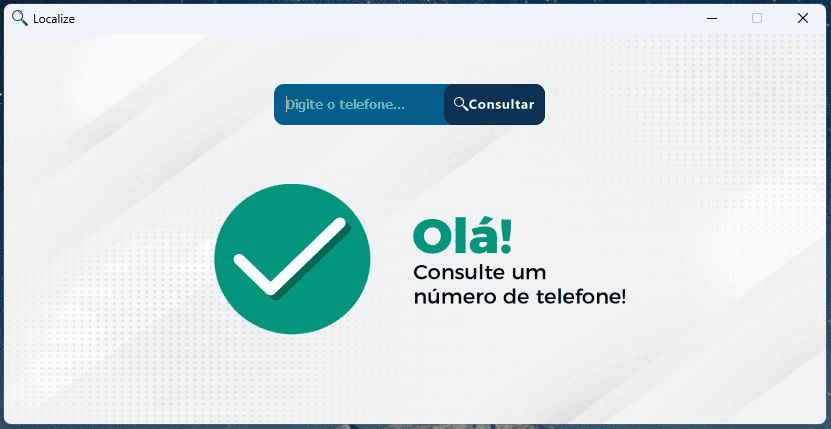
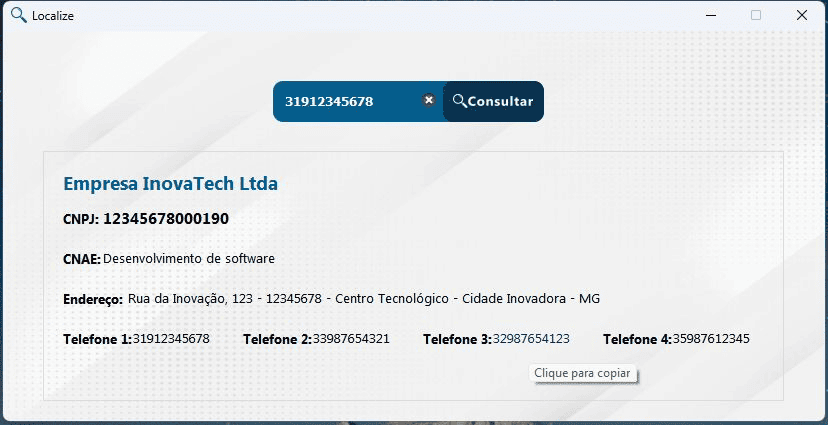
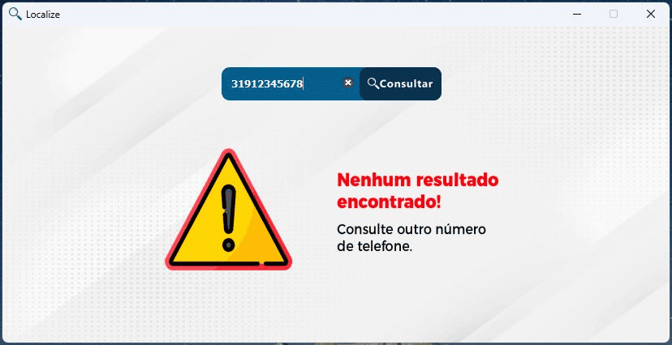

# 🚀 Sistema de Consulta de Clientes

**Localize** é um aplicativo desktop para consultar informações de clientes a partir de um número de telefone.

## 🖼️ Preview do Sistema

| Tela Inicial | Resultado da Busca | Registro Não Encontrado |
|:---:|:---:|:---:|
|  |  |  |
---

## Funcionalidades

- Busca por telefone (suporta formatos variados)  
- Consulta em banco **Access (.accdb)** via `pyodbc`  
- Pesquisa em thread para não travar a interface  
- Copiar informações com um clique (labels clicáveis)  
- Interface em **PyQt5**  
- Splash screen animada  
- Feedback claro para “encontrado / não encontrado”  
- Empacotamento em `.exe` via **cx_Freeze** (script `setup.py`)

---

## Tecnologias Utilizadas

**Desenvolvimento:** Python, PyQt5, PyODBC  
**Banco de Dados:** Microsoft Access  
**Build:** cx_Freeze

---

## Destaques do Projeto

- Arquitetura pensada para ambientes corporativos
- Execução em background sem travar a interface
- Feedback visual claro para melhor experiência do usuário
- Fácil deploy com executável independente

---

### Melhorias Futuras (possíveis evoluções)

 - Migrar banco para PostgreSQL / MySQL / MongoDB

 - Expor uma API (Flask / FastAPI) para consultas remotas

 - Integrar com n8n para automações

 - Autenticação e controle de acesso

 - Logs e auditoria de buscas

 - Versão web responsiva para uso via navegador

---

*💡 Portifólio focado em demonstrar capacidades técnicas e de desenvolvimento*
